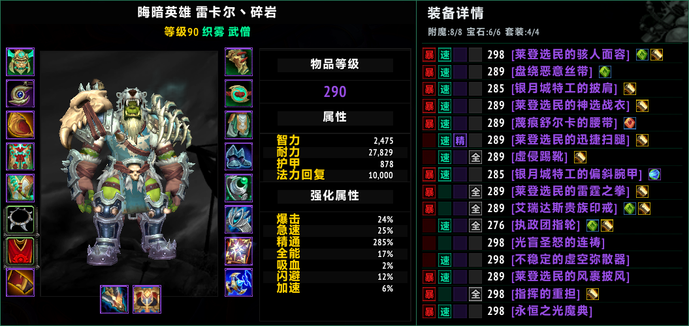

# BetterGearInfo

适用于《魔兽世界》正式服 12.x 的独立插件，美化角色界面，并展示自身及被观察玩家的装备、装等、属性、附魔、宝石和套装进度。<br>
A standalone addon for World of Warcraft Retail 12.x, featuring a styled character panel and equipped gear details for yourself and inspected players, including item levels, stats, enchantments, gems, and set progress.

## 界面预览



## 功能

- 深色角色界面，外框使用与中性灰混合的柔和职业色；左右面板相接处显示一像素边框。
- 右栏列出 16 个装备栏位，每行显示暴击、急速、精通、全能标记、物品等级、品质色物品链接，以及宝石和附魔图标。行间以极淡的职业色细线分隔。
- 属性方块始终保留主题色背景和边框，装备没有的属性不显示文字。制造业装备的品质小图标不显示在装备行中。
- 顶部显示“装备详情”及“附魔:X/N  宝石:X/N  套装:X/4”，不足的项目单独标红。资料未载入时显示 --，缓存完成后自动刷新。
- 附魔按当前穿戴的头、肩、胸、裤、鞋、双戒指和主手计数。已附魔时显示卷轴图标，缺少附魔时显示红色感叹号。
- 宝石按已镶嵌数／实际插槽数计数，包括额外打孔；装备行显示宝石图标或空槽标记。
- 套装统计支持四件进度的同一套装备，混穿不同套装不合并，达到四件后显示 4/4。
- PvP 装等只按当前穿戴的装备计算。实装 PvP 平均装等高于普通装等时，左侧大数字显示“普通装等 | PvP 装等”，分隔符为灰色，PvP 数字为蓝色，原有装等悬停提示保持不变。装备行也显示对应的 PvP 装等，以淡蓝色区分。
- 观察其他玩家时显示独立装备清单；同时打开自己的角色界面和观察窗口时，各自显示各自的数据。观察窗口右侧空间不足时，清单改放到左侧。
- 右栏只随角色页显示，切换声望或货币页时隐藏，返回角色页时恢复。各页顶部标题保持居中。
- 两侧右上角的细线 X 仅在鼠标进入各自框体内时显示，隐藏时不可点击，鼠标停在 X 上时提亮。右栏 X 只临时收起清单，再次打开对应窗口即恢复；左侧 X 保留原生关闭行为。
- 左侧三个切换按钮使用原生图案，居中于角色信息栏，仅在鼠标进入左侧角色框体时显示。
- 属性与强化属性标签去掉冒号，标签和值均向内缩进，并在原生界面刷新后继续保持。

## 安装

将 `BetterGearInfo` 文件夹放到：

```text
World of Warcraft/_retail_/Interface/AddOns/BetterGearInfo/
```

文件夹内应直接包含 `BetterGearInfo.toc`、`BetterGearInfo.lua`、本说明文件和 `LICENSE`。重启游戏，在插件列表启用 **BetterGearInfo**，按 `C` 打开角色界面。

GitHub 自动检查的 `BetterGearInfo` 构建产物内包含安装 ZIP。若下载的是 GitHub 源码 ZIP，解压后请将目录重命名为 `BetterGearInfo`；开发文件无需安装到游戏中。

支持正式服 12.x，界面文案目前主要为简体中文。插件使用游戏原生纹理与 API，无需安装其他界面插件。已安装的附魔索引库可补充具体附魔的物品或法术提示；其他观察插件的重复装备清单会被隐藏，其其他功能继续保留。

## 命令

- `/bgi`：重新显示当前角色或观察窗口旁的装备清单。
- `/bgi status`：显示版本、初始化状态和具体错误。
- `/bettergearinfo`：与 `/bgi` 相同；也支持 `status` 参数。

## 设计来源

左侧角色界面风格参考了 **ElvUI**；右侧装备详情栏的灵感来源于 **TinyInspect**。在此基础上重新做了美化和修复。

## 开发与协议

源码仓库：[StareAbyss/BetterGearInfo](https://github.com/StareAbyss/BetterGearInfo)。开发、打包及 PR 约定见 [CONTRIBUTING.md](CONTRIBUTING.md)。

BetterGearInfo 的代码使用 [MIT 协议](LICENSE)。游戏原生纹理通过 API 引用，不随插件打包。
